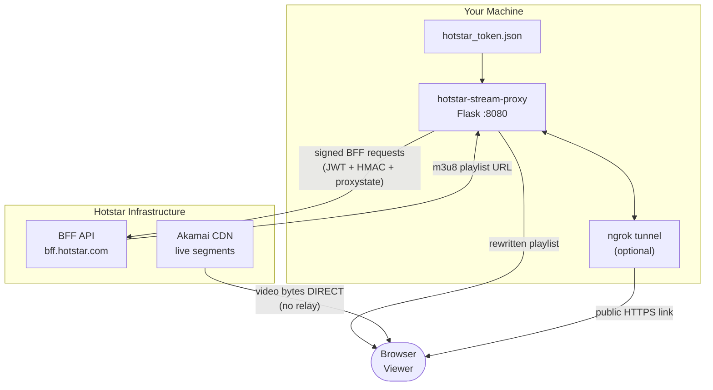
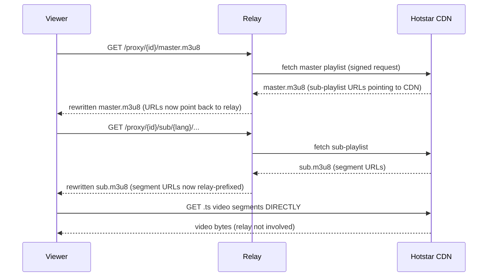
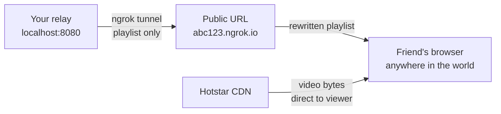

<div align="center">


# hotstar-stream-proxy

**A self-hosted Python relay that converts any JioHotstar live stream URL into a shareable browser link.**
No app install. No subscription check. No geo-block for your friends.

<br />

[](https://python.org)
[](https://flask.palletsprojects.com)
[](https://developer.apple.com/streaming)
[](https://ngrok.com)
[](LICENSE)
[](https://github.com/arvind88765/hotstar-stream-proxy/stargazers)

<br />

[What This Does](#what-this-does) · [How It Works](#how-it-works) · [Setup](#setup) · [Usage](#usage) · [Share with Friends](#share-with-friends) · [FAQ](#faq)

</div>

---

## What This Does

Hotstar locks streams behind authentication, geo-checks, and TLS fingerprinting. This relay sits between your browser and Hotstar, handles all of that on your behalf, and gives you a clean public link to share.

```
1. Run the relay on your machine
2. Log in with OTP through the built-in browser UI
3. Paste any Hotstar live URL
4. Copy the generated link and share it
```

Your machine only proxies the tiny playlist files (a few KB every 2 seconds). All video bytes travel directly from Hotstar's CDN to each viewer. Bandwidth cost on your end is minimal.

---

## How It Works

### System Architecture



### Protection Layers Bypassed

| Layer | What Hotstar Does | How the Relay Handles It |
|---|---|---|
| TLS Fingerprint | Rejects non-Chrome TLS handshakes | `curl_cffi` impersonates Chrome 131 at the TLS layer |
| JWT Auth | Every BFF call requires a valid login token | Built-in OTP login saves token to `hotstar_token.json` |
| Proxystate | Short-lived bot-shield stamp on every BFF call | Fetched from `/bff/v2/start` on demand, cached for 55 minutes |
| HMAC Signing | Every BFF request must carry a timed HMAC signature | Signs with the key extracted from the Hotstar APK |
| CORS | Browser blocks cross-origin CDN requests | Flask proxy adds `Access-Control-Allow-Origin: *` |
| CDN Headers | CDN validates `sec-fetch-site: same-site` | Sends the exact headers observed in HAR captures |

### HLS Rewriting Pipeline



All three HLS layers are rewritten: master playlist, sub-playlist, and segment URLs. Segment bytes bypass the relay entirely.

---

## Setup

### Requirements

- Python 3.8+
- A JioHotstar account (used for OTP login in the browser UI)

### Install

```bash
git clone https://github.com/arvind88765/hotstar-stream-proxy
cd hotstar-stream-proxy
pip install -r requirements.txt
```

### Run

```bash
python hotstar_live.py
```

Your default browser opens at `http://localhost:8080`.

---

## Usage

### Step 1: Log In

Open the **Login** tab at `http://localhost:8080`.

```
Enter your 10-digit Indian mobile number
→ Send OTP
→ Enter the OTP Hotstar texts you
→ Verify OTP
```

Your token is saved to `hotstar_token.json`. The next time you start the relay, it detects the token and drops you straight into the Stream tab.

> **Already use [jiohotstar-downloader](https://github.com/arvind88765/jiohotstar-downloader)?**
> Both tools share the same `hotstar_token.json`. Copy it into this folder and click **Use This Token** on the Login tab. No second login needed.

### Step 2: Generate a Link

Switch to the **Stream** tab.

1. Paste a JioHotstar live URL
2. Select the audio language
3. Click **Generate Link**
4. Open the link in VLC or any browser

**Supported URL formats:**

```
https://www.hotstar.com/in/shows/bigg-boss/123456789/live
https://www.hotstar.com/in/sports/cricket/ipl-match/123456789
https://www.hotstar.com/in/channels/star-sports-1/1260008666/live
```

---

## Share with Friends

Set up an ngrok tunnel to expose your relay over a public HTTPS URL that anyone can open from anywhere.



1. Sign up at [ngrok.com](https://ngrok.com) (free tier is enough)
2. Copy your authtoken from the ngrok dashboard
3. Paste it into the **ngrok** card in the Stream tab
4. Click **Save and Start Tunnel**
5. Share the generated URL with anyone

```
You:          http://localhost:8080/watch/xxxxxxxx
Your friends: https://abc123.ngrok.io/watch/xxxxxxxx
```

Only playlist files (a few KB every 2 seconds) flow through the ngrok tunnel. Video bytes go CDN-to-viewer directly. Free tier handles it with no issues.

---

## Project Structure

```
hotstar-stream-proxy/
├── hotstar_live.py          # relay server (Flask + HLS proxy + OTP login)
├── requirements.txt         # dependencies
├── hotstar_token.json       # login token (gitignored, generated on first login)
├── ngrok_token.txt          # ngrok authtoken (gitignored)
├── hotstar_proxystate.json  # optional manual proxystate override (gitignored)
└── .gitignore
```

---

## Configuration

Everything is configured through the browser UI. The only supported environment variable:

| Variable | Description |
|---|---|
| `NGROK_AUTHTOKEN` | ngrok token, as an alternative to pasting it in the UI |

---

## FAQ

**Does this work for DRM-protected streams?**
Live HLS streams on JioHotstar are served as plain (non-DRM) HLS. DRM is used on DASH VOD content. This relay handles HLS live streams only.

**How long does a share link last?**
Around 30 minutes. Hotstar embeds time-limited `hdnea` tokens in the m3u8 URL. Use the Refresh button in the UI to get a new link without re-entering the URL.

**Do my friends need to install anything?**
No. The watch page uses `hls.js` loaded inline. Any modern browser works, including mobile.

**Will this work outside India?**
Hotstar enforces geo-restrictions. If the machine running the relay is outside India, the BFF API returns geo errors. Running the relay behind a VPN set to India fixes this.

**Is my Hotstar account safe?**
Your token is used exclusively to call Hotstar's own BFF API. It is never sent to any third-party server. The relay runs entirely on your machine.

**My token expired. What do I do?**
Tokens last around 2 hours. Open the Login tab and run the OTP flow again. The new token overwrites the old one automatically.

**Can I run this on a server (VPS)?**
Yes. Run `python hotstar_live.py` on any Linux VPS with Python 3.8+. Skip ngrok and expose port 8080 directly. You do not need the desktop browser to open since the server has no GUI.

---

## Related

- **[jiohotstar-downloader](https://github.com/arvind88765/jiohotstar-downloader)** — GUI app for downloading JioHotstar VOD content with Widevine DRM support, multi-language audio tracks, and subtitle extraction. Shares login tokens with this relay.

---

## Give it a Star

If this project saved your night during a match, leave a star. It helps people find it.

[](https://github.com/arvind88765/hotstar-stream-proxy/stargazers)

Issues and pull requests are open. If a new Hotstar API version breaks something, open an issue with the error log and the stream URL.

---

## Disclaimer

This project is for personal and educational use only. It does not redistribute, cache, or permanently store any content owned by JioHotstar, Star India, or The Walt Disney Company. It relays streams that the operator is already authorized to access, to devices the operator controls or chooses to share with. The author is not affiliated with JioHotstar or any related entity. Use responsibly and in accordance with JioHotstar's terms of service.

---

<div align="center">
  <sub>Built with Python · Flask · curl_cffi · hls.js · pyngrok</sub>
</div>
